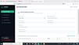

# 🟢 Laporan Pengujian - Positive Test Case
**Aplikasi:** Monitoring Service Computer (Warrior Computer)  
**Penguji:** Alba

---

| ID Test Case | Kategori | Skenario Pengujian | Test Data | Expected Result | Actual Result | Status | Bukti Screenshot |
| :--- | :--- | :--- | :--- | :--- | :--- | :--- | :--- |
| **TCP-01** | POSITIVE | Login Dengan Data Valid | USR: `@front_admin` PW: `depan123` | User Berhasil Masuk ke Dashboard Utama | Masuk ke Halaman Dashboard Utama | **PASS** |  |
| **TCP-02** | POSITIVE | Menambahkan Data Pengguna Baru | Nama: Rasyid Usr: `@rasyid` Pw: `rasyid123` Role: `Front_admin` | Data berhasil tersimpan dan langsung tampil di tabel antarmuka | Data muncul di tabel daftar pengguna | **PASS** |  |
| **TCP-03** | POSITIVE | Mengubah Progres Tahapan Servis | Ubah status dari Cek / Antrean ke Pengerjaan | Status berhasil diperbarui di database secara real-time | Tampilan status berubah di baris tabel monitoring | **PASS** |  |
| **TCP-04** | POSITIVE | Menambahkan Input Data Servis Baru | Nama: Alba WA: `08123...` Merk: Asus Keluhan: Mati Total | Data servis baru berhasil masuk ke antrean tabel monitoring | Data masuk ke halaman Monitoring Proses | **PASS** |  |
| **TCP-05** | POSITIVE | Mencetak Nota Transaksi Servis | Klik ikon detail → Klik tombol "Cetak" | Jendela Print Preview muncul dengan format nota yang lengkap | Print preview terbuka menampilkan PDF Nota | **PASS** |  |